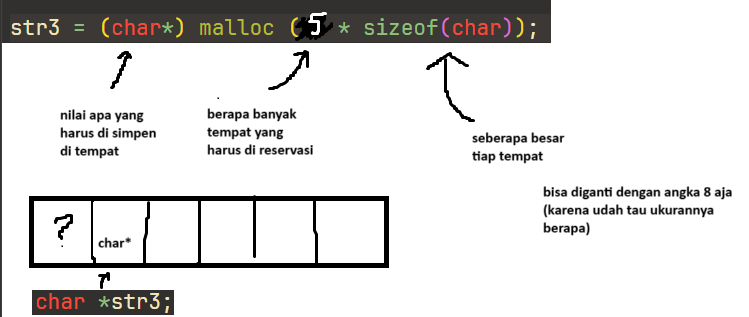

# Compiler

Tools buat ngeterjemahin bahasa pemrograman (e.g. C, Java, C++) menjadi bahasa mesin.

-   High level language
    Bahasa dengan abstraksi yang banyak, contohnya kayak Python, Scratch, dll. Kita gakperlu handle kayak memori, bikin ADT sendiri gakperlu, jadi semuanya udah di-include.

-   Low level language
    Bahasa dengan abstraksi yang gak banyak-banyak amat, ini kita harus handle memori dan bikin-bikin fungsi / ADT sendiri. Contohnya C, C++, Rust, Zig, Fortran. Biasanya dipake untuk System Engineering (bikin blackbox pesawat, alat navigasi kereta api). Benefitnya dia: 1. Super fast, karena dia itu deket sama mesin atau handle memori sendiri 2. Lebih fleksible 3. Gampang error / gak ada magic, kalo ada bug/error itu udah pasti salah kita

# Abstraksi

Cara supaya pengguna yang bakal make program kita ini gak harus ngerjain 100% manual.

Contohnya kayak kalo main IG, dan pengen ngepost foto. Kita gak harus tau gimana cara uploadnya, gimana cara disimpen ke website ignya, gaperlu tau gimana caranya nanti muncul di HP orang <- ini semua dihandle sama IG atau diabstraksi sama IG.

Hal yg serupa juga sama di pemrograman, abstraksi itu penting. Kalo lagi nulis kode reusable atau clean code.

# Coding in C

## Type, konstanta, variabel, assignment

```C
// <type> <nama_variable> = <nilai>

// sebuah angka bilangan bulat, integer
int angka = 5; // 32-bit  -2147483648 s/d 2147483647
short angka_kecil = 5; // 16-bit -32768 s/d 32767
long angka_panjang = 5; // 32-bit

// sebuah angka bilangan real, float/double
float real = 3.11;
double real_presisi = 3.1111111111111111111;
long real_super_presisi = 3.11111111111111111111111111111;
int real_salah = 3.11; // <- bakal error

// sebuah karakter, char
char huruf_a = 'a';
char panjang = 'apalah'; // <- bakal error

// sebuah rangkaian huruf, string
// String / str / string <- di C gaada gini
// apalah
// a p a l a h <- rangkaian yang kontigu, bisa disimpen di array
char str1[] = "Hello World!";
char str2[37]; // ini cuma bisa nampung 37 huruf
char *str3;
str3 = (char*) malloc (5 * sizeof(char));
str3 = "Hello World!"; // ini bakal error!
str3[0] = 'H';
str3[1] = 'e';
// dan seterusnya
```

### Penjelasan string assignment w/ pointers



## Input/output

### Input

```C
// scanf("<format>", <list-variable>);
// formats: %d (angka bulat), %s (string), %f (decimal), %c (character)

int x;
x = 0;

int* y;
*y = 0;

scanf("%d", &x);
// 10
// x bakal jadi 10

float f;
scanf("%d %f", &x, &f);
// 10 11.321

```

### Output

```C
// printf("<format>", <list-nama>);

printf("Nomor: %d dapat nilai %d", x, y);
printf("%.2f", f); /* f real */
```

## Percabangan (if/else)

```C
// if (<kondisi-1 yang hasilnya true / false>) {
//     ...
// }
// else if (<kondisi-2 yang hasilnya true / false>) {
//     ...
// }
// else {
//     ...
// }

// contohnya
// x > 5, y < 10 && z == 2

if (x % 2 == 0) {
    printf("Genap");
} else {
    printf("Ganjil");
}
```

## Pengulangan (for/while)
```C
// for loop
// for (int i = 0; i < 100; i++) {
//     ...
// }

for (int i=1; i<10; i++) {
    printf("%d", i);
}

// while loop
// while (<kondisi-jalan>) {
//     ...
// }

int i=1;
while (i<10) {
    printf("%d", i);
    i++;
}
```

## Subprogram (fungsi/prosedur)
Fungsi -> menerima input kemudian mengeluarkan output
Prosedur -> menerima input kemudian mengubah state (input masukan)

```C
// <type-output> <nama-fungsi> (<type-input1> <nama-input1> ...) {
//     ...
// } 

int multiply(int x, int y) {
    int hasil = x * y;
    return hasil;
}

multiply(1, 3);
multiply(1, 3.21); // ERROR!
multiply(1, "halo!"); // ERROR!


// void <nama-fungsi> (<type-input1> <nama-input1> ...) {
//     ...
// } 

void kurangSatu(int x) {
    x = x - 1;
}

int input = 5;
kurangSatu(input);
printf("Hasil kurang satu adalah %d\n", input);

```

# How to compile
HARUS PUNYA COMPILER GCC! Cara cek: 
`gcc --version`
Kalo gaada install dengan tutorial ini https://dev.to/gamegods3/how-to-install-gcc-in-windows-10-the-easier-way-422j

Cara compile:
`gcc <nama-file> -o <nama-file-hasil>` contoh `gcc coba.c -o keluar_angka`

Cara run:
`nama_file.exe`